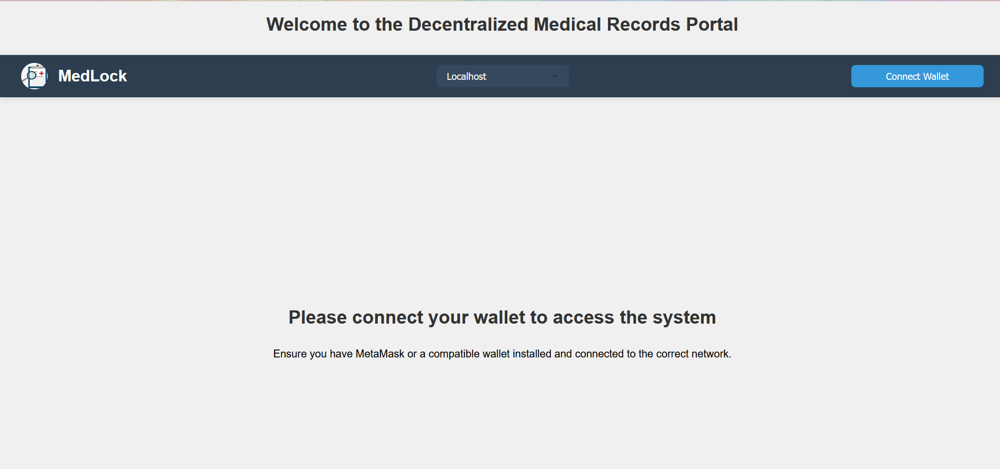
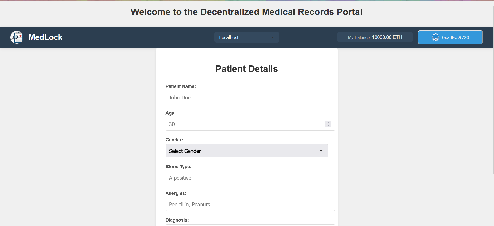
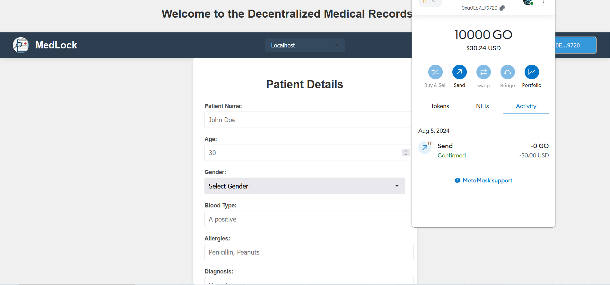

#  MedLock 

MedLock is an innovative blockchain-based project designed to give patients complete control over their healthcare data. Using Solidity smart contracts, it securely stores patient information on the Ethereum blockchain, ensuring data privacy and security.

The project is live at: [med-lock.vercel.app](https://med-lock.vercel.app)

## User Interface

### Login Page

The initial page where users can connect their wallet to access the system.

### Patient Details Page

Once logged in, users can view and manage patient details.

### MetaMask Integration

MedLock integrates with MetaMask for secure blockchain transactions and identity management.

## Features

- Patient-centric system allowing patients to control access to their data
- Secure storage of healthcare records on the blockchain
- User classification into five categories: Owner, Hospitals, Insurance Company, Doctor, and Patient
- Granular access control for patients to grant or revoke data access permissions

## Tech Stack and Tools

- Solidity (v0.8.24) - 8.4%
- JavaScript - 79.1%
- CSS - 9.0%
- HTML - 3.5%
- Hardhat
- Ethereum blockchain
- IPFS (InterPlanetary File System)
- Node.js
- Ethers.js
- React.js (for the frontend)

## How to Use

1. Clone the repository:  https://github.com/Pratham-verma/MedLock 
2. Install dependencies:   npm install 

## Smart Contract Configuration

The project uses Hardhat for Ethereum development. The `hardhat.config.js` file is set up with the following configuration:

- Solidity version: 0.8.24
- Networks:
- Hardhat (for testing)
- Localhost (for local development)

## Contributing

Contributions to MedLock are welcome! Please feel free to submit a Pull Request.
